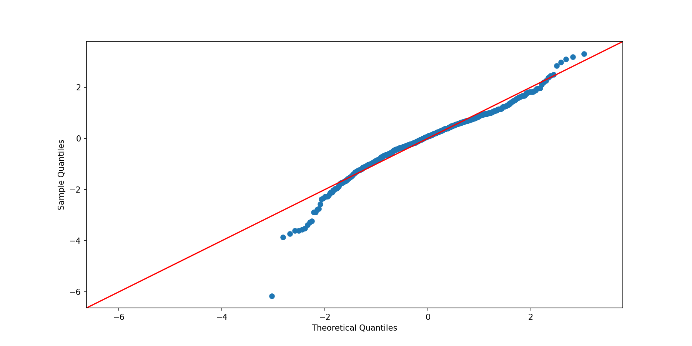

# Getting Started

1. Step 1: Choose your parameters  
Model parameters are approximations based from my experience as a French citizen.  
Please modify the parameters as you wish in *get_parameters.py*.

2. Step 2: Calculate the future gains and losses  
Run the *main.py* to start the assets simulation.

3. Step 3: Calculate the Required Retirement Fund  
Either let the *main.py* run to start the retirement simulation or run it manually with *predict_retirement.py*.

3. Step 4: Long-Term Investment Planning  
Check the metric and graphical outputs from the assets modeling and the retirement modeling.  
Remember it's a simulation. Adjust your expectations. Remember it's a simulation.

# Mechanics of the simulation
Here are the steps behind the whole model. They support the creating a personal portfolio with wealth simulation but beware of potential mistakes in the coding

1. Set our basic inflow, starting assets, taxes and income raises
2. Download historic S&P 500 index prices 
    a. We download the S&P500
    b. We calculate the average monthly return and standard deviation of a chosen historic period
    c. We store these values to use later as inputs to our Standard Normal distribution (The values are coming out as a monthly return of 0.6% and a monthly volatility (standard deviation) of 4.15%.)
3. Calculate income (with taxation)
4. Calculate outflows (including preparing retirement) and subtract them from the income
5. Generate a monthly market return by drawing from the normal distribution with taxation on investment gains
6. Generate a monthly savings return
7. Allocate the remaining income (priority to savings then to market)
8. Calculate the end of period assets value
9. Output graphs
10. Output metrics
11. Feed the results to the retirement simulation
12. Outputs metrics for failure rate of the retirement plan
13. Outputs retirement graphs
14. Please adjust your expectations  

# Notes

## Notes on the modelling

- Set a Realistic Retirement Income Goal  
Determine the amount of money you wish to have as annual income after retirement. For instance, if your goal is 3,000$ per month, this equates to 36,000$ per year.

- Consider the Impact of Inflation  
Recognize the effect of inflation on your future purchasing power. Adjust your retirement income goal accordingly, taking into account a realistic inflation rate. For instance, a 3% annual inflation rate implies that the value of money will decrease over time.

- Compute the Required Retirement Fund wisely  
Assuming a certain interest rate on your investments (e.g., 5% per year), use the formula: 
Retirement Fund = Annual Income / Interest Rate  
This calculation helps you determine the total amount needed in your retirement fund to generate the desired annual income. However, it doesn't guarantee you will escape bankrupcy nor does it guarantee you will have enough to pass on to your offspring.

- Mind the known unknown variables and the unknown unknown variables  
Estimate the annual investment required to reach your retirement fund goal. This involves factoring in the desired retirement fund, expected return on investment, and adjustments for inflation.

- Beware the assumptions

## Notes on the model assumptions

### 1. ETF assumption
The model computes the returns based on trends from a single market - for instance S&P500. 
It doesn't permit yet the computation of single assets with each their own risk/return.  
The model therefore makes the assumption that assets are computed **a)** from a tracker ETF, that tracks a whole market, and **b)** without going through a financial professional.

a) Passive ETFs (*trackers*) track a financial index as closely as possible, unlike other forms of collective investment that attempt to beat a benchmark index.  
Taking risk in a diversified way yields a certain return over the long term. The expectation of this return is proportional to the degree of risk taken.  
The more risk you take by being diversified, the higher the return you can expect after a few years. 

b) Why not invest in a diversified way through a financial professional? Why follow a stock market index?  
On average, professional managers match the performance of index ETFs, when fees are not taken into account. 
When management fees and, above all, transaction costs are taken into account, actively managed investment funds underperform ETFs, since an index ETF generally charges 5 to 15 times less in fees than an actively managed fund. 

>**The most profitable investment logic for an amateur invester would be free index investing, with the lowest possible fees**.  

>There are exceptions in opaque financial markets with large information asymmetries, such as micro-cap equities and high-yield bonds, where active management is more attractive.

Source: [Pace, Hili and Grima - 2016: Active versus passive investing: An empirical study on the US and European mutual funds and ETF](https://www.um.edu.mt/library/oar/bitstream/123456789/19202/1/Chapter%20-%20Active%20versus%20Passive%20Investing%20%20An%20Empirical%20Study%20on%20the%20US%20and%20European%20Mutual%20Funds%20and%20ETFs.pdf)

From 2009 to 2022, the S&P500 generates steady increasing returns:

## 2. Portfolio assumption

The model make the assumptions of a reasonably conservative portfolio:
- We consider only 5 major assets: Treasury Bills (basically cash), Treasury Bonds, the S&P 500, commodities, and Emerging Market Stocks (China, Brazil, Russia, etc.).

## 3. Optimization assumption (optimization available only at the retirement phase yet)

Would you have the amount passed as argument to the retirement simulation, the simulation computes an optimization.  

- We use mean variance portfolio optimization to estimate the investment weights of the optimal portfolio (highest bang for buck) with the following constraints:
   * Weights must sum to 1
   * Weights must be between 0 and 1 (no short selling)
   * Allocation to S&P 500 (LC Stocks), commodities, and EM Stocks (Emergent Markets) must sum to 0.6
- We use a Monte Carlo simulation to compute the optimization
- Inflation follows a normally distributed variable with an expected value of 2% and a standard deviation of 1%
- The investment returns follow a normal distribution
- The investment returns are correlated to each other according to a given fixed correlation heat map (as computed in 2019)
- We use Cholesky Decomposition to make the random normal shocks correlated
- We always consider an alternative model (currently with 10K more expenses per year) to check how the portfolio resists

The optimizer produces a portfolio with the following allocations: 40% in Treasury Bonds, 35% in the S&P 500, and 25% in EM Stocks. The expected annual nominal return is 5.1% and the expected annual standard deviation is 10%.
  
The optimal portfolio weights are extremely sensitive to our estimate of each asset class’ expected return, volatility, and correlation with other assets.  
The estimate used in the retirement simulation are a bit outdated, and came out of the report 2019 from BNY Mellon. [Here is the latest version](https://www.bnymellonwealth.com/content/dam/bnymellonwealth/pdf-library/articles/202310YearCapitalMarketAssumptions.pdf)

## Notes on the normality assumption of markets

Making the normality assumption that returns of assets like stocks and bonds follow a normal distribution probably understates the likelihood and therefore risk of fat tails (severe market crashes occur more frequently than the models tell us they should).
* Fat tails in the negative side already happened in history.  
* Also, the actual distribution of monthly S&P 500 returns is skinnier in its center than the normal distribution.

The skinny middle and the fat tails imply that the normal distribution might not be the best describer of stock returns. Rather, there seem to be 2 regimes:
* a calm regime where we spend most of the time that is normally distributed (but with a lower volatility than 12%) 
* a regime with high volatility and terrible returns.

A demonstration of the existence of such events is available [Here](https://towardsdatascience.com/are-stock-returns-normally-distributed-e0388d71267e)

However we can verify still that by looking at the QQ plot for monthly S&P 500 returns (*qq_plot.png*).

While most of the observations do fall more or less on the red line, we can see significant deviations on the left tail and smaller ones on the right tail.

The value on the X-axis tells us how frequently we expect to see an observation of that magnitude on a normal distribution (Z-scores, a.k.a. standard deviations away from the mean, which implies a probability).  
The value on the Y-axis (Z-scores) tells us how frequently we actually see it.  

The 2 outlying dots on the left represent S&P 500 returns of worse than -20%. Given that the dataset is 843 monthly observations in total, the 2 outlier dots represent a mere 0.237% of our observations. A -20% monthly return is a 6 sigma event (6 standard deviations below the mean).  
We observed 2 returns worse than -20%, meaning 2 six sigma events (once in 90 million year type events) in a dataset that is only 70 years long.  
We can pretty confidently state that no stock returns are not normal.

## Notes on the S&P

* When we plot our series of investment returns we can see that they are indeed stochastic in nature, with the inherent randomness of returns meaning some months we are up, some we are down even though our average monthly return used as an input to the Standard Normal function was positive.  
* As a slight point to note – please be aware that some of the plots are showing the series of cumulative monthly investment returns, whereas some of them are showing the series of ending period asset value – they are different things!  
* We have modelled our monthly active salary (with an annual percentage increase), along with our monthly investment returns which we have subjected to a stochastic element to mimic the real-world.

## Notes on physical vs synthetic replication

* A physical/direct ETF invests directly in the securities of the index it is designed to replicate.
    * *Full replication* invests in all the securities in the index
    * *Sampling replication* invests in the securities with the highest weight, those that are the most liquid or with other considerations that cause it to deviate from the index
* A synthetic/derivative ETF is designed to replicate the return of a selected index (e.g., S&P 500 or FTSE 100) just like any other ETF. But instead of holding the underlying securities or assets, they use financial engineering to achieve the desired results.

Often, in France, there is no choice, as in the case of PEA ETFs that replicate non-EEA indices.  
If you do have a choice, synthetic replication is, on average, more faithful to the index than physical replication for the same assets and index.

However, synthetic replication is more complex to understand, and if you don't understand it, you're better off investing in physical replication.  
Both methods are equivalent over the long term and present similar counterparty risks: physical replication with securities lending (completely opaque, with an underlying conflict of interest), synthetic replication with the concentration of risk on a single counterparty.

## Notes on investment failures

The code allowed for a situation where we go could “bust”, losing everything we have in terms of investable assets, and continue “investing” a negative amount.  
This is obviously nonsensical as you cant make positive returns from a negative asset base, just because the market returns are negative. We will add a flag that checks to make sure our asset base is in positive territory before we start calculating and applying investment returns; if our asset base is negative, there are a few things we can do to ac count for that – 

Just for example we could:
* Consider that situation “unnaceptable” to the extent we class ourselves as “ruined/bankrupt” and end the simulation with a “failure” flaf or label.
* Allow the simulation to continue and collect salary income each month, but each month where assets are non-positive, we set the investment gains to zero by default.
* Apply some non-trivial logic that applies interest and penalty charges, allow us to borrow and re-invest etc.

The last option, is just not realistic nor really the point of this exercise. We go for option 1, considering an asset base of zero to be unacceptable and a sign of abject failure with regards to money management and such. 
You could even argue that even getting close to a zero value asset base is unacceptable and want to set the “failure” threshold somewhere above zero. We can revisit these options later perhaps if it is of benefit.

We deal with a failed simulation by recording a “failure flag” – mark that run as failed for later analysis. This reasoning will become a bit clearer later on when we start to apply Monte Carlo methods to our model, carrying out 100s, 1000s or more simulations per “experiment”.

## Notes on retirement

Retirement is an important stage of life to plan for; not only would our inflows from salary be affected, it is likely many of our outflows would change too.  
By retirement age, it is not uncommon for people to have paid off any outstanding mortgage debt on their homes. This means no more monthly mortgage outflows, and offers other opportunities such as equity release schemes, or “downsizing” of property etc.  
In other words, both our post-retirement inflows and outflows are usually fundamentally different from the “normal”, non-retirement situation. For instance, we no longer pay rent or mortgage payments.  
We could also imagine our health insurance costs and general medical expenses would rise significantly on average, and we might start to receive some pension income each month

### Planning one's retirement: Uncertainty

Quantitatively modeling someone’s retirement is extremely difficult and fraught with uncertainty and unknowns. 
The main drivers of this variance are uncertainty around:
* Investment returns
* Inflation
* How much you will spend annually in retirement
* How long you will live (and how healthy you will be)
* Black swans — hard to predict events such as financial crises, wars, white walkers, etc.
* Model error (error from incorrect estimates and assumptions)
* Changes to Social Security, income tax rates, capital gains tax rates, etc.

In the script, we use Monte Carlo Simulation to quantitatively explore drivers 1 through 4 in detail.

### Planning one's retirement: Setting an amount

We set a future date at which we plan to retire and effectively cease working, with the accompanying expectation that our active income (i.e. salary) will fall dramatically, if not disappear altogether. 

**Of utmost importance is to ensure that by the time you retire, you have built an asset base large enough to sustain your needs and generate enough investment income to cover your living costs, for however many years you end up living in retirement.**

Indeed, we can sometimes observe the effect our drop in salary after retirement has on our ending asset values through time. With no salary coming, there is the tendency for our personal wealth and asset base to fall over time. 

It's a good idea to set aside 240 to 600 times the monthly pension you'd like to receive when you retire, in addition to your retirement pension, so that you can withdraw this amount without running out of money until you die. 

# Work in progress: plan
- computing retirement from multiple countries (e.g., automatic pension from a job in France & manual pension from a job in the US)
- assets: find better metrics?
- add transactions (remove, reinsert, discrete expenses, discrete incomes, withdraws, close booklets, move assets, sell real estate)
- loans
- exchange rates!
- simulate multiple strategies to invest?
- index of taxation by country to automatically compute?
- interbank transfers?
- make a real estate track
- find a way to fine-grain the investments? (chose a brand, not only a market?)
- use java or else to visualize in html
- GUI?

Have default parameters, but at launch launch a GUI to ask if parameters have been defined manually.
If so, open a menu with all parameters: take the given value if it exists, otherwise take the default value. 

# Acknowledgments

* I'd like first to thank **Stuart J.** for his series on creating a personal portoflio/wealth simulation if Python. I got started by implementing his great tutorial from [Python For Finance](https://www.pythonforfinance.net/2021/06/13/create-a-personal-portfolio-wealth-simulation-in-python/)  
* I'd like to thank **Tony Yiu** and his series on simulating retirement. I Implemented his retirement simulation from [Towards Data Science](https://towardsdatascience.com/do-i-have-enough-money-to-retire-af7914a07b34). I also gathered evidence on few assumptions about markets from his works on Towards Data Science.
